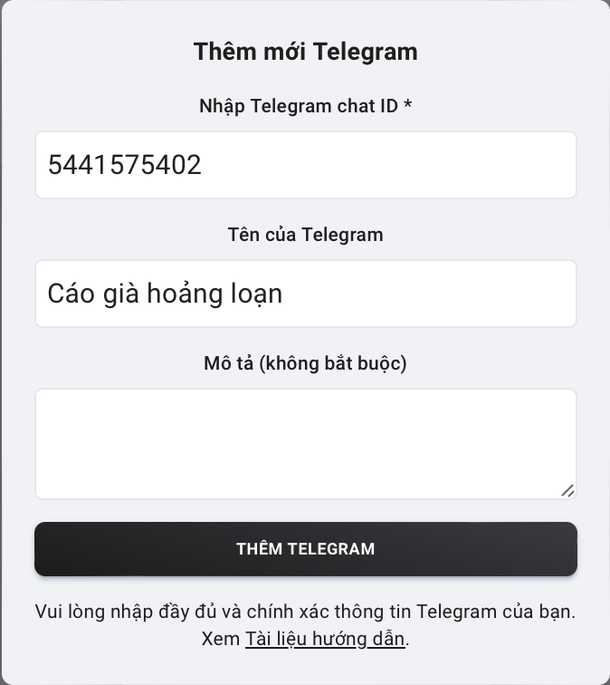

# Hướng Dẫn Thêm Telegram ID Vào Tài Khoản Ngân Hàng

Để nhận thông báo biến động số dư tài khoản ngân hàng qua Telegram, bạn cần thực hiện các bước sau:

### 1. **Vào Mục Danh Sách Telegram**: 

Truy cập vào phần quản lý Telegram trong ứng dụng của bạn, sau đó bấm vào nút Mở bot Telegram như hình để lấy Telegram ID của bạn.

Tiếp theo, sau khi bot đã được mở, bạn bấm vào nút '/id' ngay bên dưới để lấy Telegram ID của bạn, copy ID và quay về trang danh sách Telegram ID trước đó, bấm nút **Tạo mới** để thêm mới Telegram ID.

### 2. **Thêm Mới**: 

Điền Telegram ID bạn đã được bot đưa rồi chọn sự kiện thông báo: Nhận, gửi, nhận và gửi, bạn có thể điền tên một cách tuỳ chọn để tránh nhầm lẫn.

### 3. **Thêm vào tài khoản**:

Chuyển đến tab "Danh sách tài khoản", lưu ý bạn phải thêm tài khoản ngân hàng trước đó để mới có thể liên kết được Telegram ID vừa tạo với ngân hàng.

Sau đó bạn bấm vào "Xem Telegram" tại tài khoản bạn muốn lắng nghe số dư, và bấm vào "Thêm".

Từ đây bạn chọn Telegram ID vừa tạo ở danh sách xổ xuống, chọn sự kiện thông báo, nhấn nút **OK** là xong.

### 4. **Hoàn tất**: 

Từ đây, bạn sẽ nhận được thông báo biến động số dư về tài khoản Telegram của bạn. Điều này cho phép mọi người trong nhóm Telegram nhận được thông tin biến động số dư tài khoản ngân hàng một cách nhanh chóng trong vòng 20 giây.

