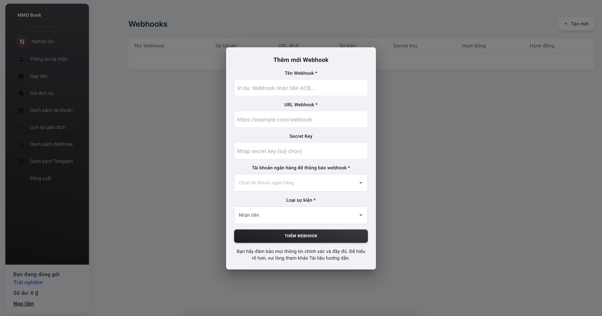

# Tạo Hook

## Secret key là gì?

Secret key được bạn cung cấp ở bước Tạo Hook trên Swift Pays.

Secret key giúp xác minh dữ liệu giao dịch là chính xác được gửi từ Swift Pays qua hệ thống của bạn thông qua các endpoint được khai báo.

**Input**

```md
// Định dạng secret-key

{ 'Content-Type: application/json', 'secret-key: secret-key }
```

## Cách tạo Hook

Đầu tiên các bạn truy cập vào khu vực `Danh sách Webhooks` -> `Tạo mới` -> Thêm sẽ thấy giao diện như sau:

Các tham số tạo Hook:

```
- Tên Webhook *
- URL Webhook *
- Secret Key
- Tài khoản ngân hàng để thông báo webhook *
- Loại sự kiện *
```

::: info
`Tên Webhook *`

Ví dụ: Webhook nhận tiền ACB...

`URL Webhook *`

Là địa chỉ sẽ nhận dữ liệu được Swift Pays gửi tới theo điều kiện thiết lập. Bạn có thể chỉ định tùy ý đầu nhận dữ liệu ở mục này.

Tùy thuộc vào website của bạn có sử dụng SSL hay không mà lựa chọn http hoặc https cho phù hợp!

`Secret Key`

Nhập Secret Key (tuỳ chọn) hoặc bỏ trống.

`Tài khoản ngân hàng để thông báo webhook *`

Đây là mục cho phép bạn chọn tài khoản muốn Hook gửi dữ liệu giao dịch đi sang hệ thống khác. Tài khoản này được thêm ở phần Liên kết trên hệ thống Swift Pays.

Nghĩa là bạn cần phải liên kết tài khoản trước khi chuyển qua bước Tạo Hook này !

`Loại sự kiện *`

Sự kiện chính là dữ liệu mà bạn muốn Swift Pays sẽ gửi sang Endpoint. Dữ liệu này có thể là:

- Gửi và nhận (tất cả sự kiện)
- Nhận tiền
- Chuyển tiền

:::

`Chu kỳ gửi dữ liệu`

`Gửi ngay lập tức khi có phát sinh dữ liệu.`
